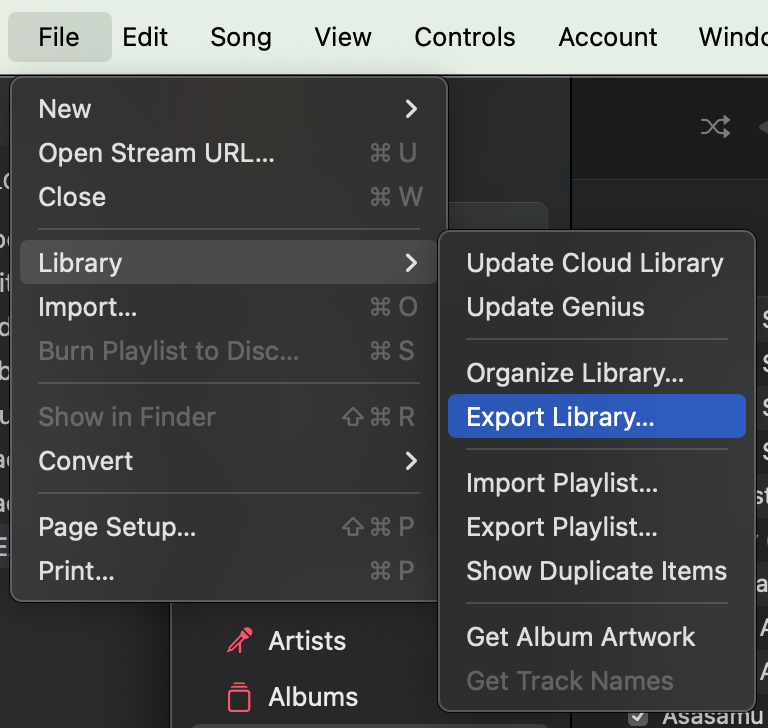

1. Open Apple Music. Choose `File > Library > Export Library`.
   
2. Save to this folder as `Library.xml`
3. ```
   cd apple-music-library-reader
   npm ci
   npm run exec
   ```
4. View `output.json` to see songs with the same name by different artists.
5. Modify `index.mjs` to change the transformation.
